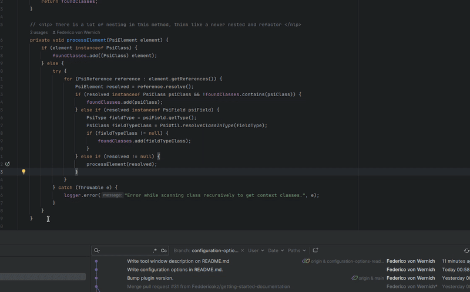
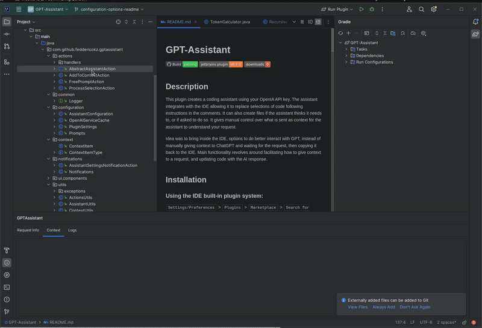
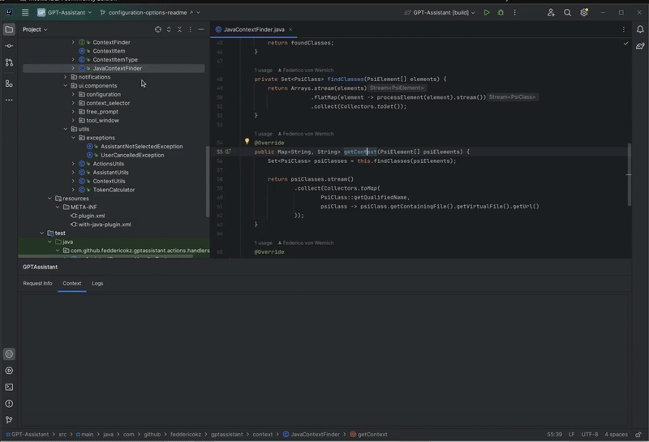

# GPT-Assistant


[](https://plugins.jetbrains.com/plugin/com.github.feddericokz.gptassistant)
[](https://plugins.jetbrains.com/plugin/com.github.feddericokz.gptassistant)


<!-- Plugin description -->

## Description

This plugin creates a coding assistant using your OpenIA API key. The assistant integrates with the IDE allowing it 
to replace selections of code following instructions in the comments. It can also create files if the assistant thinks 
it needs to, or if asked to do so.
It gives manual control over what is sent as context for the assistant to understand your request.

Idea was to bring inside the IDE, options to do better interact with GPT, instead of manually giving context to ChatGPT
and waiting for the request, then copying it back to the IDE. Main functionality revolves around facilitating how to
give context to a request, and updating code with the AI response.
<!-- Plugin description end -->

## Installation

### Using the IDE built-in plugin system:
  
  <kbd>Settings/Preferences</kbd> > <kbd>Plugins</kbd> > <kbd>Marketplace</kbd> > <kbd>Search for "GPT-Assistant"</kbd> >
  <kbd>Install</kbd>
  
### Manually:

  Download the [latest release](https://github.com/Feddericokz/GPT-Assistant/releases/latest) and install it manually using
  <kbd>Settings/Preferences</kbd> > <kbd>Plugins</kbd> > <kbd>⚙️</kbd> > <kbd>Install plugin from disk...</kbd>


## Getting started

In order to start using the plugin, you need to give it a OpenIA API key. You can get yours heading over to
https://platform.openai.com/api-keys.

Once you have the API key, head over to <kbd>Settings</kbd> > <kbd>Tools</kbd> > <kbd>GPT Assistant Settings</kbd> 
and set your API key.


> [!WARNING]  
> Notice how I have to close the settings window and re-open it for the API to kick in, hopefully will be fixed in a later
> release.

## Configuration options

These options can be found at <kbd>Settings</kbd> > <kbd>Tools</kbd> > <kbd>GPT Assistant Settings</kbd>

| Configuration                        | Description                                                                                                                        |
|--------------------------------------|------------------------------------------------------------------------------------------------------------------------------------|
| OpenAI API Key                       | Required for authenticating with OpenAI services. Please enter a valid API key.                                                    |
| Reformat processed code              | This configuration is enabled by default, but can be disabled in case it's not working as expected.                                |
| Token Threshold                      | Defines a threshold after which the user will be asked for consent before making the request. Set 0 to disable asking for consent. |
| OpenAI Timeout (seconds)             | Maximum time in seconds before a request to OpenAI times out.                                                                      |
| Retrieve Run Interval (milliseconds) | Interval in milliseconds between checks for task completion.                                                                       |

### Assistants panel


In this panel, an assistant should have been already created for you. I think the prompt works pretty well out of the box,
but us humans have a creative nature, so I left some room for customization of the prompt, along with the model it uses.

More assistants could be created, with slightly different instructions customized for specific cases. For example,
an assistant could be instructed to prefer one set of libraries over the other, try to enforce coding conventions and
patterns that your project should follow, or anything you can think of really.

> [!IMPORTANT]  
> You should be careful not to break the response format of the assistant, since it expects a specific format.
> If the plugin doesn't receive the response in this format, it won´t know how to handle the response.
> Make sure you read it carefully and understand how it works, and then proceed to tweak behavior of the assistant.

To make it short, this panel lets you manage assistants, you can:
* Create new assistants.
* Delete existing assistants.
* Visualize information about existing assistants, such as the model and instructions.
* Select an assistant to use for processing requests.

## Assistant Tool Window

This tool window has 3 tabs to mostly display useful information, you can interact with the Context one tho.

### Request Info


This tab displays information to help us understand what the assistant did. Basically to debug the AI behavior.

#### Request Steps

The AI is asked to reason the steps it has to perform to solve the task given by the user. They're displayed in this tab.

#### User Request

The AI is asked to report what it understood the user request was. The statement is displayed in this tab.

#### Imports

If the AI determines an import needs to be added, it will be displayed here.

#### Code Replacement

The AI is given the ability to replace selected code. The code replacement will be displayed here.

#### File Creation

The AI is given the ability to create one or more files. They will be displayed here.

### Context


There is a global context, to which we can add files using the project tree. Files in this context are displayed here, and
they also can be removed from the context.

We can choose to send this global context as information when making request to the assistant.

### Logs


I just needed a place to dump logs that was easy for me to monitor, you probably don't care about this.
Might be helpful to report an issue with the plugin.

## Actions

### Process selection Action



This action is only present in the Editor context menu. It instructs the assistant to provide code to replace the 
current selection following an instruction written in a code comment. 
User instructions should be placed inside a nlp xml tag. Example:

```java
// <nlp> User instructions... </nlp>
```

Many instructions could be given at different parts of the code using many comments.

> [!NOTE]
> Instruction in comments are useful when you want to give many instructions at once, but for a single instruction it might
> be better to just prompt it in a text before making the request. Will try to add this feature in  a later release.


### Add to context Action



This action is only present in Project tree context menu. It allows adding files to the global assistant context. Supports
adding any file and directory to the context. Many files could be selected at once.

### Free prompt Action



This action is present on both menu's. It lets you give instructions to the assistant outside the context of a selection.
Right now the assistant can just replace code and create classes, so outside the context of a selection it can just create classes.

> [!NOTE]
> I plan to add more abilities to the assistant, at least to ask questions about classes in the context. 

---
Plugin based on the [IntelliJ Platform Plugin Template][template].

[template]: https://github.com/JetBrains/intellij-platform-plugin-template
[docs:plugin-description]: https://plugins.jetbrains.com/docs/intellij/plugin-user-experience.html#plugin-description-and-presentation
